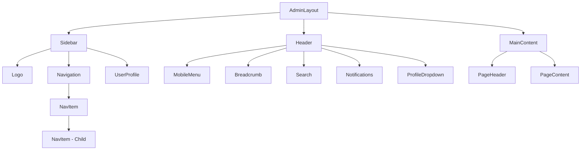
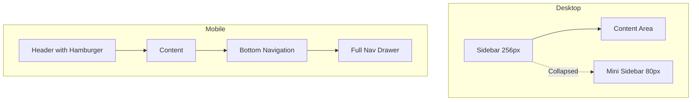
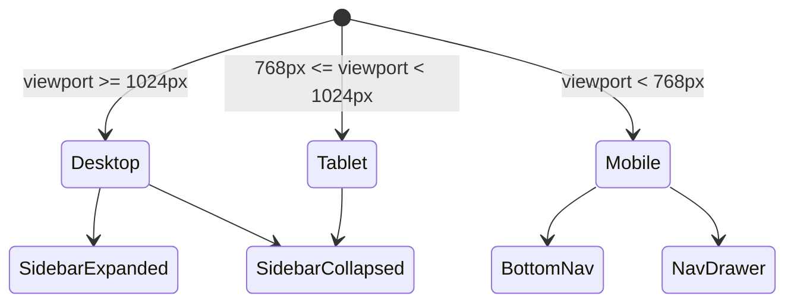

# BookBharat Admin Design Update Plan

## Executive Summary
This document outlines a comprehensive plan to update the BookBharat Admin panel with a clean, professional, and mobile-friendly design using a **Modern Minimal** approach inspired by contemporary SaaS dashboards like Vercel and Stripe.

---

## Design Decisions

| Decision | Choice | Rationale |
|----------|--------|-----------|
| Design Style | Modern Minimal | Clean, timeless, reduces cognitive load |
| Color Scheme | Keep Blue (#3B82F6) | Professional, already established in codebase |
| Dark Mode | Phase 2 (later) | Focus on core improvements first |
| Priority | All pages equally | Consistent user experience throughout |

---

## Technology Stack

- **Frontend:** React 19 + TypeScript
- **Styling:** Tailwind CSS 3.3
- **UI Components:** Headless UI, Lucide Icons
- **State Management:** Zustand + TanStack Query
- **Routing:** React Router DOM 7

---

## Design System

### Color Palette

```css
/* Primary - Blue */
--primary-50:  #EFF6FF;
--primary-100: #DBEAFE;
--primary-200: #BFDBFE;
--primary-300: #93C5FD;
--primary-400: #60A5FA;
--primary-500: #3B82F6;  /* Main */
--primary-600: #2563EB;
--primary-700: #1D4ED8;
--primary-800: #1E40AF;
--primary-900: #1E3A8A;
--primary-950: #1E3A8A;

/* Neutral - Gray */
--gray-50:  #F9FAFB;
--gray-100: #F3F4F6;
--gray-200: #E5E7EB;
--gray-300: #D1D5DB;
--gray-400: #9CA3AF;
--gray-500: #6B7280;
--gray-600: #4B5563;
--gray-700: #374151;
--gray-800: #1F2937;
--gray-900: #111827;
--gray-950: #030712;

/* Semantic Colors */
--success-50:  #ECFDF5;
--success-500: #10B981;
--success-600: #059669;

--warning-50:  #FFFBEB;
--warning-500: #F59E0B;
--warning-600: #D97706;

--error-50:    #FEF2F2;
--error-500:   #EF4444;
--error-600:   #DC2626;

--info-50:     #EFF6FF;
--info-500:    #3B82F6;
--info-600:    #2563EB;
```

### Typography

```css
/* Font Family */
--font-sans: 'Inter', -apple-system, BlinkMacSystemFont, 'Segoe UI', sans-serif;
--font-mono: 'JetBrains Mono', 'Fira Code', monospace;

/* Font Sizes */
--text-xs:   0.75rem;    /* 12px */
--text-sm:   0.875rem;   /* 14px */
--text-base: 1rem;       /* 16px */
--text-lg:   1.125rem;   /* 18px */
--text-xl:   1.25rem;    /* 20px */
--text-2xl:  1.5rem;     /* 24px */
--text-3xl:  1.875rem;   /* 30px */

/* Font Weights */
--font-normal:    400;
--font-medium:    500;
--font-semibold:  600;
--font-bold:      700;

/* Line Heights */
--leading-tight:  1.25;
--leading-normal: 1.5;
--leading-relaxed: 1.625;
```

### Spacing Scale

```css
--spacing-0:  0;
--spacing-1:  0.25rem;  /* 4px */
--spacing-2:  0.5rem;   /* 8px */
--spacing-3:  0.75rem;  /* 12px */
--spacing-4:  1rem;     /* 16px */
--spacing-5:  1.25rem;  /* 20px */
--spacing-6:  1.5rem;   /* 24px */
--spacing-8:  2rem;     /* 32px */
--spacing-10: 2.5rem;   /* 40px */
--spacing-12: 3rem;     /* 48px */
--spacing-16: 4rem;     /* 64px */
```

### Border Radius

```css
--radius-sm:   0.25rem;  /* 4px */
--radius-md:   0.375rem; /* 6px */
--radius-lg:   0.5rem;   /* 8px */
--radius-xl:   0.75rem;  /* 12px */
--radius-2xl:  1rem;     /* 16px */
--radius-full: 9999px;
```

### Shadows

```css
--shadow-sm:   0 1px 2px 0 rgb(0 0 0 / 0.05);
--shadow-md:   0 4px 6px -1px rgb(0 0 0 / 0.1), 0 2px 4px -2px rgb(0 0 0 / 0.1);
--shadow-lg:   0 10px 15px -3px rgb(0 0 0 / 0.1), 0 4px 6px -4px rgb(0 0 0 / 0.1);
--shadow-xl:   0 20px 25px -5px rgb(0 0 0 / 0.1), 0 8px 10px -6px rgb(0 0 0 / 0.1);
--shadow-card: 0 1px 3px 0 rgb(0 0 0 / 0.1), 0 1px 2px -1px rgb(0 0 0 / 0.1);
--shadow-float: 0 4px 14px 0 rgb(0 0 0 / 0.11);
```

---

## Component Specifications

### 1. Button Component

```tsx
// Variants
type ButtonVariant = 'primary' | 'secondary' | 'outline' | 'ghost' | 'danger';

// Sizes
type ButtonSize = 'sm' | 'md' | 'lg';

// Props
interface ButtonProps {
  variant?: ButtonVariant;
  size?: ButtonSize;
  loading?: boolean;
  leftIcon?: React.ReactNode;
  rightIcon?: React.ReactNode;
  fullWidth?: boolean;
}

// Styling
const variants = {
  primary: 'bg-primary-600 text-white hover:bg-primary-700 active:bg-primary-800',
  secondary: 'bg-gray-100 text-gray-900 hover:bg-gray-200 active:bg-gray-300',
  outline: 'border border-gray-300 bg-white hover:bg-gray-50 active:bg-gray-100',
  ghost: 'text-gray-600 hover:bg-gray-100 hover:text-gray-900',
  danger: 'bg-error-600 text-white hover:bg-error-700 active:bg-error-800',
};

const sizes = {
  sm: 'h-8 px-3 text-sm gap-1.5',
  md: 'h-10 px-4 text-sm gap-2',
  lg: 'h-12 px-6 text-base gap-2',
};
```

### 2. Card Component

```tsx
// Variants
type CardVariant = 'default' | 'elevated' | 'bordered';

// Props
interface CardProps {
  variant?: CardVariant;
  padding?: 'none' | 'sm' | 'md' | 'lg';
  hoverable?: boolean;
}

// Parts
- Card (container)
- CardHeader (title, subtitle, actions)
- CardContent (main content)
- CardFooter (actions)

// Styling
const variants = {
  default: 'bg-white shadow-card',
  elevated: 'bg-white shadow-lg',
  bordered: 'bg-white border border-gray-200',
};
```

### 3. Input Component

```tsx
// Variants
type InputVariant = 'default' | 'filled' | 'flush';

// Sizes
type InputSize = 'sm' | 'md' | 'lg';

// Props
interface InputProps {
  variant?: InputVariant;
  size?: InputSize;
  label?: string;
  error?: string;
  helper?: string;
  leftIcon?: React.ReactNode;
  rightIcon?: React.ReactNode;
  clearable?: boolean;
}

// Styling
const variants = {
  default: 'border border-gray-300 bg-white focus:border-primary-500 focus:ring-primary-500',
  filled: 'border-0 bg-gray-100 focus:bg-white focus:ring-primary-500',
  flush: 'border-0 border-b border-gray-300 rounded-none focus:border-primary-500',
};
```

### 4. Table Component

```tsx
// Features
- Sticky header
- Row hover highlight
- Sortable columns with indicators
- Row selection with checkboxes
- Responsive card view for mobile
- Empty state with illustration
- Loading skeleton

// Props
interface TableProps {
  columns: Column[];
  data: T[];
  selectable?: boolean;
  onSort?: (key: string, direction: 'asc' | 'desc') => void;
  pagination?: PaginationConfig;
  loading?: boolean;
  emptyState?: React.ReactNode;
}

// Mobile Card View
<MobileCard>
  <MobileCardHeader>
    <Avatar />
    <Title />
    <Badge />
  </MobileCardHeader>
  <MobileCardContent>
    <Field label="Status" value="Active" />
    <Field label="Created" value="Jan 15, 2024" />
  </MobileCardContent>
  <MobileCardActions>
    <Button variant="ghost" size="sm">Edit</Button>
    <Button variant="ghost" size="sm">Delete</Button>
  </MobileCardActions>
</MobileCard>
```

### 5. Modal Component (NEW)

```tsx
// Sizes
type ModalSize = 'sm' | 'md' | 'lg' | 'xl' | 'full';

// Props
interface ModalProps {
  open: boolean;
  onClose: () => void;
  title?: string;
  description?: string;
  size?: ModalSize;
  closeOnOverlayClick?: boolean;
  closeOnEsc?: boolean;
}

// Parts
- Modal (container with backdrop)
- ModalHeader (title, close button)
- ModalBody (content)
- ModalFooter (actions)
```

### 6. Drawer Component (NEW)

```tsx
// Positions
type DrawerPosition = 'left' | 'right' | 'bottom';

// Props
interface DrawerProps {
  open: boolean;
  onClose: () => void;
  position?: DrawerPosition;
  title?: string;
  width?: string;
}

// Parts
- Drawer (container with backdrop)
- DrawerHeader (title, close button)
- DrawerBody (content)
- DrawerFooter (actions)
```

### 7. Badge Component

```tsx
// Variants
type BadgeVariant = 'default' | 'primary' | 'success' | 'warning' | 'error' | 'info';

// Sizes
type BadgeSize = 'sm' | 'md' | 'lg';

// Props
interface BadgeProps {
  variant?: BadgeVariant;
  size?: BadgeSize;
  dot?: boolean;
  removable?: boolean;
  onRemove?: () => void;
}

// Styling
const variants = {
  default: 'bg-gray-100 text-gray-800',
  primary: 'bg-primary-100 text-primary-800',
  success: 'bg-success-50 text-success-700',
  warning: 'bg-warning-50 text-warning-700',
  error: 'bg-error-50 text-error-700',
  info: 'bg-info-50 text-info-700',
};
```

### 8. Skeleton Component (NEW)

```tsx
// Variants
type SkeletonVariant = 'text' | 'circle' | 'rect';

// Props
interface SkeletonProps {
  variant?: SkeletonVariant;
  width?: string | number;
  height?: string | number;
  animate?: boolean;
}

// Usage
<Card>
  <Skeleton variant="circle" width={40} height={40} />
  <Skeleton variant="text" width="60%" />
  <Skeleton variant="rect" height={100} />
</Card>
```

---

## Layout Architecture

### Admin Layout Structure

```
┌─────────────────────────────────────────────────────────────────────┐
│  HEADER (h-16)                                                       │
│  ┌─────────────────────────────────────────────────────────────┐   │
│  │ ☰ │ Breadcrumb │      Search      │ 🔔 │ 👤 Profile         │   │
│  └─────────────────────────────────────────────────────────────┘   │
├──────────┬──────────────────────────────────────────────────────────┤
│          │  PAGE HEADER (py-6)                                      │
│  SIDEBAR │  ┌──────────────────────────────────────────────────┐   │
│  (w-64)  │  │ Title │ Description           [Primary Action]   │   │
│          │  └──────────────────────────────────────────────────┘   │
│  ┌─────┐ ├──────────────────────────────────────────────────────────┤
│  │ 🏠  │ │  MAIN CONTENT (px-6 pb-8)                               │
│  │ Dash│ │                                                          │
│  ├─────┤ │  ┌─────────┐ ┌─────────┐ ┌─────────┐ ┌─────────┐       │
│  │ 📦  │ │  │ Stat    │ │ Stat    │ │ Stat    │ │ Stat    │       │
│  │Sales│ │  │ Card    │ │ Card    │ │ Card    │ │ Card    │       │
│  │  ▾  │ │  └─────────┘ └─────────┘ └─────────┘ └─────────┘       │
│  │  ├ 📋│ │                                                          │
│  │  └ 🛒│ │  ┌────────────────────────────────────────────────┐   │
│  ├─────┤ │  │                                                │   │
│  │ 🏷️  │ │  │              Data Table                        │   │
│  │Catalog│ │  │                                                │   │
│  │  ▾  │ │  └────────────────────────────────────────────────┘   │
│  └─────┘ │                                                          │
├──────────┴──────────────────────────────────────────────────────────┤
│  MOBILE BOTTOM NAV (h-16, md:hidden)                                │
│  ┌───────┬───────┬───────┬───────┬───────┐                         │
│  │  🏠   │  📋   │  📦   │  👤   │  ⋯   │                         │
│  │ Home  │ Orders│Products│Profile│ More │                         │
│  └───────┴───────┴───────┴───────┴───────┘                         │
└─────────────────────────────────────────────────────────────────────┘
```

### Sidebar Design

```tsx
// Collapsible Sidebar
- Expanded: 256px (w-64)
- Collapsed: 80px (w-20) - icon only
- Mobile: Drawer overlay

// Navigation Item States
- Default: text-gray-600
- Hover: bg-gray-50 text-gray-900
- Active: bg-primary-50 text-primary-700 border-l-2 border-primary-600
- Expanded: ChevronDown rotated 180deg

// Group Headers
- text-xs font-semibold text-gray-400 uppercase tracking-wider
- px-3 py-2
```

### Header Design

```tsx
// Structure
- Left: Menu toggle (mobile) | Breadcrumb
- Center: Global search (expandable)
- Right: Notifications | Profile dropdown

// Breadcrumb
<Breadcrumb>
  <BreadcrumbItem>Home</BreadcrumbItem>
  <BreadcrumbSeparator />
  <BreadcrumbItem>Products</BreadcrumbItem>
  <BreadcrumbSeparator />
  <BreadcrumbItem current>Edit Product</BreadcrumbItem>
</Breadcrumb>

// Profile Dropdown
- Avatar with user initials
- Name and role
- Links: Profile, Settings, Sign out
```

---

## Mobile-First Improvements

### Responsive Breakpoints

```css
/* Mobile First */
sm: 640px   /* Small devices */
md: 768px   /* Tablets */
lg: 1024px  /* Laptops */
xl: 1280px  /* Desktops */
2xl: 1536px /* Large screens */
```

### Mobile Navigation

```tsx
// Bottom Tab Bar (md:hidden)
const mobileNavItems = [
  { icon: Home, label: 'Home', href: '/dashboard' },
  { icon: ClipboardList, label: 'Orders', href: '/orders' },
  { icon: Package, label: 'Products', href: '/products' },
  { icon: User, label: 'Profile', href: '/profile' },
  { icon: MoreHorizontal, label: 'More', href: '#', onClick: openDrawer },
];

// Full Navigation Drawer (for More)
<Drawer position="left" open={moreOpen}>
  <FullNavigation />
</Drawer>
```

### Mobile Tables

```tsx
// Card View Toggle (md:hidden)
{isMobile ? (
  <div className="space-y-4">
    {data.map(item => (
      <MobileCard key={item.id} item={item} />
    ))}
  </div>
) : (
  <Table columns={columns} data={data} />
)}

// Mobile Card Structure
<div className="bg-white rounded-lg border border-gray-200 p-4">
  <div className="flex items-start justify-between mb-3">
    <div className="flex items-center gap-3">
      <Avatar src={item.image} name={item.name} />
      <div>
        <h3 className="font-medium">{item.name}</h3>
        <p className="text-sm text-gray-500">{item.id}</p>
      </div>
    </div>
    <Badge variant={item.status}>{item.status}</Badge>
  </div>
  <dl className="grid grid-cols-2 gap-2 text-sm">
    <div>
      <dt className="text-gray-500">Price</dt>
      <dd className="font-medium">{formatPrice(item.price)}</dd>
    </div>
    <div>
      <dt className="text-gray-500">Stock</dt>
      <dd className="font-medium">{item.stock}</dd>
    </div>
  </dl>
  <div className="flex justify-end gap-2 mt-4 pt-4 border-t">
    <Button variant="ghost" size="sm">Edit</Button>
    <Button variant="ghost" size="sm">Delete</Button>
  </div>
</div>
```

### Mobile Forms

```tsx
// Full-width inputs with larger touch targets
<Input 
  size="lg"  // h-12 for better touch
  fullWidth
  className="text-base"  // Prevent iOS zoom
/>

// Floating labels for cleaner look
<div className="relative">
  <input
    className="peer pt-6 pb-2 px-4 ..."
    placeholder=" "
  />
  <label className="absolute top-2 left-4 text-xs text-gray-500 peer-placeholder-shown:top-4 peer-placeholder-shown:text-base transition-all">
    Email
  </label>
</div>

// Sticky form actions on mobile
<div className="fixed bottom-0 left-0 right-0 bg-white border-t p-4 md:static md:border-t-0 md:p-0">
  <div className="flex gap-3">
    <Button variant="outline" fullWidth>Cancel</Button>
    <Button variant="primary" fullWidth>Save</Button>
  </div>
</div>
```

---

## Implementation Checklist

### Phase 1: Foundation (Tailwind Config)

- [ ] Update `tailwind.config.js` with design tokens
  - [ ] Add custom colors
  - [ ] Add font family (Inter)
  - [ ] Add spacing scale
  - [ ] Add border radius
  - [ ] Add shadows
  - [ ] Add animations

- [ ] Update `src/index.css`
  - [ ] Import Inter font
  - [ ] Add CSS custom properties
  - [ ] Add base styles for body
  - [ ] Add utility classes

### Phase 2: Core Components

- [ ] Update `Button.tsx`
  - [ ] Add all variants
  - [ ] Add sizes
  - [ ] Add loading state
  - [ ] Add icon support
  - [ ] Update styling

- [ ] Update `Card.tsx`
  - [ ] Add variants
  - [ ] Add CardHeader, CardContent, CardFooter
  - [ ] Add hover states

- [ ] Update `Input.tsx`
  - [ ] Add variants
  - [ ] Add sizes
  - [ ] Add icon support
  - [ ] Improve focus states

- [ ] Update `Table.tsx`
  - [ ] Add mobile card view
  - [ ] Add row selection
  - [ ] Add loading skeleton
  - [ ] Add empty state

- [ ] Update `Badge.tsx`
  - [ ] Add all variants
  - [ ] Add sizes
  - [ ] Add dot indicator

- [ ] Create `Modal.tsx`
  - [ ] Add all sizes
  - [ ] Add backdrop
  - [ ] Add close handlers

- [ ] Create `Drawer.tsx`
  - [ ] Add positions
  - [ ] Add animations
  - [ ] Add close handlers

- [ ] Create `Skeleton.tsx`
  - [ ] Add variants
  - [ ] Add animation

- [ ] Create `EmptyState.tsx`
  - [ ] Add illustration
  - [ ] Add action button

### Phase 3: Layout

- [ ] Redesign `AdminLayout.tsx`
  - [ ] Add collapsible sidebar
  - [ ] Add mobile bottom nav
  - [ ] Improve header with breadcrumb
  - [ ] Add global search
  - [ ] Update styling

- [ ] Create `Sidebar.tsx`
  - [ ] Add collapse functionality
  - [ ] Add navigation groups
  - [ ] Add active indicators

- [ ] Create `Header.tsx`
  - [ ] Add breadcrumb
  - [ ] Add search
  - [ ] Add notifications
  - [ ] Add profile dropdown

- [ ] Create `MobileNav.tsx`
  - [ ] Add bottom tabs
  - [ ] Add more drawer

### Phase 4: Pages

- [ ] Update `Login.tsx`
  - [ ] Redesign with modern look
  - [ ] Add proper spacing
  - [ ] Add loading animation

- [ ] Update `Dashboard/index.tsx`
  - [ ] Redesign stat cards
  - [ ] Improve charts styling
  - [ ] Add quick actions

- [ ] Update `Products/ProductList.tsx`
  - [ ] Improve filter bar
  - [ ] Add mobile card view
  - [ ] Add bulk actions toolbar

- [ ] Update `Orders/OrderList.tsx`
  - [ ] Improve status filters
  - [ ] Add mobile card view
  - [ ] Improve row actions

- [ ] Update `Customers/index.tsx`
  - [ ] Add mobile card view
  - [ ] Improve filters

### Phase 5: Polish

- [ ] Add page transitions
- [ ] Add loading states
- [ ] Add empty states
- [ ] Add error states
- [ ] Add success animations
- [ ] Test all responsive breakpoints
- [ ] Test touch interactions
- [ ] Accessibility audit

---

## File Structure

```
src/
├── components/
│   ├── ui/
│   │   ├── Button.tsx         ✏️ Update
│   │   ├── Card.tsx           ✏️ Update
│   │   ├── Input.tsx          ✏️ Update
│   │   ├── Table.tsx          ✏️ Update
│   │   ├── Badge.tsx          ✏️ Update
│   │   ├── Checkbox.tsx       ✏️ Update
│   │   ├── Modal.tsx          ➕ Create
│   │   ├── Drawer.tsx         ➕ Create
│   │   ├── Skeleton.tsx       ➕ Create
│   │   ├── EmptyState.tsx     ➕ Create
│   │   ├── Breadcrumb.tsx     ➕ Create
│   │   ├── Avatar.tsx         ➕ Create
│   │   ├── Dropdown.tsx       ➕ Create
│   │   ├── Tooltip.tsx        ➕ Create
│   │   └── index.ts           ✏️ Update exports
│   └── ...
├── layouts/
│   ├── AdminLayout.tsx        ✏️ Redesign
│   ├── Sidebar.tsx            ➕ Create
│   ├── Header.tsx             ➕ Create
│   └── MobileNav.tsx          ➕ Create
├── pages/
│   ├── Login.tsx              ✏️ Redesign
│   ├── Dashboard/
│   │   └── index.tsx          ✏️ Update
│   ├── Products/
│   │   ├── ProductList.tsx    ✏️ Update
│   │   └── ...
│   ├── Orders/
│   │   ├── OrderList.tsx      ✏️ Update
│   │   └── ...
│   └── ...
├── styles/
│   └── globals.css            ✏️ Update (or index.css)
├── tailwind.config.js         ✏️ Update
└── ...
```

---

## Mermaid Diagrams

### Component Hierarchy



### Page Layout Flow



### State Management



---

## Tailwind Config Update

```javascript
// tailwind.config.js
/** @type {import('tailwindcss').Config} */
module.exports = {
  content: [
    "./src/**/*.{js,jsx,ts,tsx}",
    "./public/index.html",
  ],
  theme: {
    extend: {
      colors: {
        primary: {
          50: '#EFF6FF',
          100: '#DBEAFE',
          200: '#BFDBFE',
          300: '#93C5FD',
          400: '#60A5FA',
          500: '#3B82F6',
          600: '#2563EB',
          700: '#1D4ED8',
          800: '#1E40AF',
          900: '#1E3A8A',
          950: '#1E3A8A',
        },
        gray: {
          50: '#F9FAFB',
          100: '#F3F4F6',
          200: '#E5E7EB',
          300: '#D1D5DB',
          400: '#9CA3AF',
          500: '#6B7280',
          600: '#4B5563',
          700: '#374151',
          800: '#1F2937',
          900: '#111827',
          950: '#030712',
        },
        success: {
          50: '#ECFDF5',
          100: '#D1FAE5',
          500: '#10B981',
          600: '#059669',
          700: '#047857',
        },
        warning: {
          50: '#FFFBEB',
          100: '#FEF3C7',
          500: '#F59E0B',
          600: '#D97706',
          700: '#B45309',
        },
        error: {
          50: '#FEF2F2',
          100: '#FEE2E2',
          500: '#EF4444',
          600: '#DC2626',
          700: '#B91C1C',
        },
      },
      fontFamily: {
        sans: ['Inter', '-apple-system', 'BlinkMacSystemFont', 'Segoe UI', 'sans-serif'],
        mono: ['JetBrains Mono', 'Fira Code', 'monospace'],
      },
      boxShadow: {
        'card': '0 1px 3px 0 rgb(0 0 0 / 0.1), 0 1px 2px -1px rgb(0 0 0 / 0.1)',
        'float': '0 4px 14px 0 rgb(0 0 0 / 0.11)',
      },
      animation: {
        'fade-in': 'fadeIn 0.2s ease-in-out',
        'slide-in': 'slideIn 0.3s ease-out',
        'slide-up': 'slideUp 0.3s ease-out',
      },
      keyframes: {
        fadeIn: {
          '0%': { opacity: '0' },
          '100%': { opacity: '1' },
        },
        slideIn: {
          '0%': { transform: 'translateX(-100%)' },
          '100%': { transform: 'translateX(0)' },
        },
        slideUp: {
          '0%': { transform: 'translateY(10px)', opacity: '0' },
          '100%': { transform: 'translateY(0)', opacity: '1' },
        },
      },
    },
  },
  plugins: [],
}
```

---

## CSS Custom Properties (index.css)

```css
@import url('https://fonts.googleapis.com/css2?family=Inter:wght@400;500;600;700&display=swap');

@tailwind base;
@tailwind components;
@tailwind utilities;

@layer base {
  :root {
    /* Colors */
    --color-primary: 59 130 246;
    --color-success: 16 185 129;
    --color-warning: 245 158 11;
    --color-error: 239 68 68;
    
    /* Layout */
    --sidebar-width: 16rem;
    --sidebar-collapsed-width: 5rem;
    --header-height: 4rem;
    --mobile-nav-height: 4rem;
    
    /* Animation */
    --transition-fast: 150ms;
    --transition-normal: 200ms;
    --transition-slow: 300ms;
  }
  
  html {
    -webkit-font-smoothing: antialiased;
    -moz-osx-font-smoothing: grayscale;
  }
  
  body {
    @apply font-sans text-gray-900 bg-gray-50;
  }
  
  /* Focus visible styles */
  :focus-visible {
    @apply outline-none ring-2 ring-primary-500 ring-offset-2;
  }
  
  /* Scrollbar styling */
  ::-webkit-scrollbar {
    @apply w-2 h-2;
  }
  
  ::-webkit-scrollbar-track {
    @apply bg-transparent;
  }
  
  ::-webkit-scrollbar-thumb {
    @apply bg-gray-300 rounded-full;
  }
  
  ::-webkit-scrollbar-thumb:hover {
    @apply bg-gray-400;
  }
}

@layer components {
  /* Card hover effect */
  .card-hover {
    @apply transition-all duration-200 hover:shadow-lg hover:-translate-y-0.5;
  }
  
  /* Sidebar nav item */
  .nav-item {
    @apply flex items-center gap-3 px-3 py-2 text-sm font-medium rounded-lg transition-colors;
  }
  
  .nav-item-active {
    @apply bg-primary-50 text-primary-700;
  }
  
  .nav-item-inactive {
    @apply text-gray-600 hover:bg-gray-50 hover:text-gray-900;
  }
  
  /* Mobile card */
  .mobile-card {
    @apply bg-white rounded-xl border border-gray-200 p-4 space-y-3;
  }
  
  /* Stat card */
  .stat-card {
    @apply bg-white rounded-xl shadow-card p-6;
  }
}

@layer utilities {
  /* Hide scrollbar */
  .scrollbar-hide {
    -ms-overflow-style: none;
    scrollbar-width: none;
  }
  
  .scrollbar-hide::-webkit-scrollbar {
    display: none;
  }
  
  /* Text truncation */
  .line-clamp-2 {
    display: -webkit-box;
    -webkit-line-clamp: 2;
    -webkit-box-orient: vertical;
    overflow: hidden;
  }
  
  .line-clamp-3 {
    display: -webkit-box;
    -webkit-line-clamp: 3;
    -webkit-box-orient: vertical;
    overflow: hidden;
  }
}
```

---

*Document Version: 1.0*
*Last Updated: 2026-03-14*
*Status: Ready for Implementation*